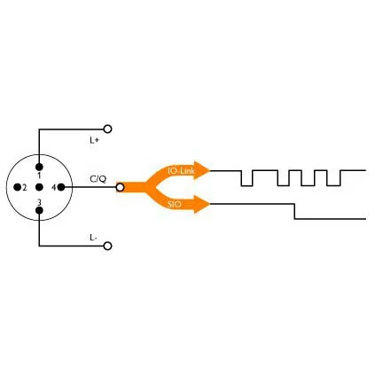

<h1 align="Left">
  <br>
  
  <br>
  HEI-Vs Engineering School - Industrial Automation Base
  <br>
</h1>

Cours AutB

Author: [Cédric Lenoir](mailto:cedric.lenoir@hevs.ch)
> Version 2025, V1.0

# LAB 03 Programmierung eines Funktionsblocks (FB), der einen Entfernungssensor verwaltet.

In dieser Arbeit werden wir einen Funktionsblock (FB) programmieren, der einen Abstandssensor verwalten kann.


Im ersten Ansatz könnte man nur die Grundinformation verwenden, die der Sensor liefert, nämlich die gemessene Entfernung.
Wenn man jedoch zusätzliche Funktionen implementieren möchte, muss man diese in einer POU (Program Organization Unit) programmieren, die als **Funktionsblock (FB)** bezeichnet wird.
Alle Funktionen werden in diesem Funktionsblock „eingekapselt“ und können von allen Sensoren desselben Typs mithilfe von **Instanzen** dieses FBs genutzt werden.


# Beschreibung des Sensors
Der Entfernungssensor, den wir im Rahmen dieser praktischen Arbeit verwenden werden, wird von der Firma [Baumer](https://www.baumer.com/ch/en) hergestellt.
Er verwendet die Triangulations-Lasermesstechnik, um die Entfernung zum Zielobjekt zu bestimmen.

<u> Referenz des Sensors</u>: O300.DL-GM1J.72N (11199079)

<div align="center">
    
    <figcaption>Capteur de distance Baumer - O300.DL</figcaption>
</div>

<br>

Dieser Sensor basiert auf der Punkt-zu-Punkt-Kommunikationsschnittstelle **IO-Link** (entspricht der Norm IEC 61131-9).

## How does the IO-Link work?

<div align="center">
    
    <figcaption>How does the_IO-Link work ?</figcaption>
</div>

<br>

Im Gegensatz zu herkömmlichen Systemen, bei denen die Analog-Digital-Wandlung auf der analogen Eingangskarte der SPS stattfindet, wird sie hier direkt im Sensor vorgenommen.

<br>

## Technische Daten

|Eigentum |Wert|
|-----------------------------------|-------------|
| Messabstand Sd |30 ... 250 mm|
|Strahlform |Punkt|
| Optische Ausrichtungsachse |< 2°|
|Spannungsbereich +Vs |11 ... 30 VDC
| Max. Stromverbrauch (ohne Last) |30 mA|
|Restspannung Vd |< 2,5 VDC|
|Verpolungsschutz |ja|
| Kurzschlussgeschützt |ja|
|Interface |IO-Link V1.1|
| Betriebstemperatur |-10 ... +60 °C|
|Schutzklasse |IP 67|


<br>

Diese Daten interessieren vor allem die Person, die die Hardware verwalten wird.


Der Programmierer der SPS wiederum wird an den Sensordaten interessiert sein, auf die er lesend und je nach Zugriffsrechten auch schreibend zugreifen kann.


## Synchrone Daten
**Synchrone Daten** (Processdata) sind Daten, die in regelmäßigen Zeitabständen übertragen werden. Man findet sie in der folgenden Tabelle.

### IO-Link "Processdata"
|8-23|7|6|5|4|3|2|1|0|
|----|-|-|-|-|-|-|-|-|
|MDC1| | | | |A|Q| |BDC1|


**MDC1**: Messwert des Sensors
**A**: Alarm-Bit (zeigt an, dass es ein Problem mit der Konfiguration oder der Funktionalität des Sensors gibt)
**Q**: Qualitätsbit (zeigt an, dass die Signalqualität unterhalb eines vorkonfigurierten Schwellenwerts liegt)
**BDC1**: Logischer Schaltausgang des Sensors


<br>

## Asynchrone Daten
**Asynchrone** Daten sind solche, die ohne strikte zeitliche Synchronisation gelesen oder verändert werden können.
Ein Teil der Einstellungen wird unten als Beispiel gezeigt.

Die [vordefinierten Parameter](#io-link-pre-defined-parameters) dienen der Identifizierung des Sensors. Mit den [Binärkanalparametern](#io-link-binary-data-channels) kann beispielsweise ein Schwellenwert innerhalb des Erfassungsbereichs des Sensors eingestellt werden.


### IO-Link Pre defined parameters
|Index      |Subindex (dec) |Access |Parameter name |Coding |Definition|
|-----------|---------------|-------|---------------|-------|----------|
|0x000C (12)| 0             |R/W    |Device Access Locks| Uint16|0: Unlocked (default)
|           |               |       |             |       |1: Device is operating properly|
|0x0010 (16)| 0             |R      |Vendor Name| String|Baumer Electric AG|
|0x0011 (17)| 0             |R      |Vendor Text| String|www.baumer.com|
|0x0012 (18)| 0             |R      |Device Name| String|Product Key External (<Product Key Internal>)|
|0x0013 (19)| 0             |R      |Product Id| String|Baumer Article Number|
|0x0014 (20)| 0             |R      |Device Text| String|Sensor specific|
|0x0015 (21)| 0             |R      |Serial Number| String|Production Order Nr / Serial Nr |
|0x0017 (23)| 0             |R      |Firmware Revision| String|Major.Minor “##.##”|
|0x0018 (24)| 0             |R/W    |Application Specific Tag|String| Default: Filled with ******, as recommended by the IO-Link spec.|
|0x0024 (36)| 0             |R      |Device Status| Uint16| 0: Device is operating properly
|           |               |       |             |       | 1: Device is operating properly
|           |               |       |             |       | 2: Out-of-Specification
|           |               |       |             |       | 3: Functional-Check
|           |               |       |             |       | 4: Failure
|           |               |       |             |       | 5 - 255: Reserved|
|0x0025 (37)| 0             |R      |Detailed Device Status| Uint16| EventQualifier “0x00” EventCode “0x00, 0x00”


<br>


### IO-Link Binary Data Channels
|Index      |Subindex (dec) |Access |Parameter name| Coding| Definition|
|-----------|---------------|-------|---------------|-------|----------|
|0x003c (60)| 01            |R/W    | Setpoint SP1  |Uint16 |Teach Point [mm] (TP)|
|           | 02            |R/W    |Setpoint SP2   |Uint16 |Not supported|
|0x003d (61)| 01            |R/W    |Switchpoint logic|Uint8|0x00: not inverted 0x01: inverted|
|           | 02            |R/(W)  |Switchpoint mode|Uint8|Fixed value 0x01: Single point mode|


<br>

Die Verwaltung asynchroner Parameter kann direkt von der SPS aus erfolgen. 
Aufgrund der Natur der SPS, die sich hauptsächlich mit zyklischen Aufgaben befasst, ist sie für diese Art von Arbeit jedoch wenig geeignet.
<br>
Eine andere Möglichkeit ist die Verwendung von Software, die von den Anbietern zur Verfügung gestellt wird und die es ermöglicht, die Sensoren zu parametrieren, ohne die SPS zu benutzen.
Als Beispiel sei hier die Software der Firma „Baumer“ genannt: [Baumer Sensor Suite (BSS)](https://www.baumer.com/us/en/products/baumer-sensor-suite/a/baumer-sensor-suite).

<br>

Damit eine SPS auf einen IO-Link-Sensor zugreifen kann, ist ein **IO-Link Master** erforderlich.
<br>

Dieses Modul fungiert als Gateway, das eine bidirektionale Kommunikation ermöglicht
zwischen dem „IO-Link“-Protokoll und dem Feldbusprotokoll der SPS (Profinet, EtherCAT, Ethernet/IP, Modbus TCP usw.).

<div align="center">
    
    <figcaption>IO-Link master Profinet 8 Port IP67</figcaption>
</div>


<br>


# Praktische Arbeit

<u> Ziel </u> :
Programmieren Sie einen Funktionsblock (FB), der die synchronen Daten des Abstandssensors liest und verarbeitet, indem Sie einige Funktionalitäten einbauen

<br>

## Beschreibung der Schnittstelle des Funktionsblocks (FB)


### Input

|Name   |Type       |Description|
|-------|-----------|-----------|
|Enable	|BOOL	    |Activate Function Block, set data value in output if valid.|
|HighThreshold|REAL|Sets upper switching threshold|
|LowThreshold|REAL|Sets lower switching threshold|
|DefaultOut  |REAL        |Default value when problems occur

### In Out
|Name   |Type       |Description|
|-------|-----------|-----------|
|hw |UA_O300_DL |In the particular context of the ctrlX to S7 interface.|


### Output
|Name         |Type         |Description         |
|-------------|:------------|--------------------|
|InOperation	|BOOL	        |Valid data at output|
|Value	|REAL	        |Distance from object in mm|
|HighLimit	      |BOOL	        |Distance above HighThreshold   |
|LowLimit	      |BOOL	        |Distance below LowThreshold   |
|Error	      |BOOL	        |There is an error   |
|ErrorID	    |WORD         |Some details about the error with Error Code.|

|ErrorID Code |Description|
|-------------|-----------|
|16#0000      |Data valid |
|16#0001      |Quality bit, signal is below the configured threshold.|
|16#0002      |Alarm bit, signal an error in sensor, this alarm has priority over ID 16#0001|
|16#0003      |Id not defined|

<br>

## Verhalten des Funktionsblocks (FB)

Es gibt einige grundlegende Modelle, die das Verhalten von Funktionsblöcken beschreiben.

Als Beispiele können genannt werden :

- Das Modell **"In Operation Base “**, das kontinuierlich arbeitet.
- Das Modell **"Execute “**, das nach dem Prinzip einer punktuellen Auslösung funktioniert.

Die Verwaltung eines Sensors ist ein typisches Beispiel für die Funktionsweise eines FB nach dem Modell **"In Operation Base “**.
Der FB wird so lange ausgeführt, wie sein Eingang ``Enable`` aktiviert ist.

<br>


Das Zustandsdiagramm eines Funktionsblocks vom Typ **In Operation Base** lässt sich wie folgt darstellen: 


<figure>
    
    <figcaption>Diagramm Basiszustände</figcaption>
</figure>


<br>

Dieses Zustandsdiagramm kann durch Hinzufügen eines „globalen Zustands“ ``InOp`` verbessert werden, der die folgenden Zustände integriert:

- ``LevelOk``
- ``LevelLow``
- ``LevelHigh``


<figure>
    
    <figcaption>Diagramm „Gesamtzustand“</figcaption>
</figure>


<br>


Diese Variante kann sich jedoch als etwas kompliziert zu programmieren erweisen. Sie wird im Rahmen einer späteren praktischen Arbeit behandelt.

<u>N.B. </u>: Es wäre theoretisch möglich, direkt von ``LevelLow`` zu ``LevelHigh``,zu wechseln, aber das trägt nichts zur allgemeinen Funktionsweise bei und erfordert zusätzliche Übergänge.
<br>

Eine andere Möglichkeit, dieses Zustandsdiagramm darzustellen, besteht darin, alle Zustände separat zu verwenden.


<figure>
    
    <figcaption>Diagramm getrennte Zustände</figcaption>
</figure>


<br>


Man stellt schnell fest, dass selbst bei einer begrenzten Anzahl von Zuständen die vollständige Darstellung schnell schwer lesbar wird.

**Diese Darstellung wird dennoch verwendet, um unseren Funktionsblock (FB) zu programmieren.**

<br>

### Ausgangssignal bei Fehlfunktionen oder Störungen
Je nachdem, wie der Sensor verwendet wird, kann ein falscher Lesewert ein Problem darstellen.

Wenn der Sensor einen Fehler hat (Alarm-Bit-Signal) oder die Qualität des Signals (Quality-Bit-Signal) nicht stimmt, **wollen wir auf keinen Fall, dass das Ausgangssignal ``Value`` auf 0** gesetzt wird.

In diesem Fall wird der Eingang ``DefaultOut`` dem Ausgang ``Value`` zugewiesen. 

<u>Hinweis</u>: Das System kann mit einem Standardwert für ``DefaultOut`` getestet werden, der auf 251 gesetzt ist (das ist 1 [mm] mehr als der theoretische Messbereich des Sensors).

<br>

# Zu erledigende Arbeit

1.  Programmieren Sie den DUT (Data User Type) ``E_OperationBaseDL`` vom Typ ENUM (Aufzählung), der die verschiedenen möglichen Zustände des Sensors enthält.
2.  Programmieren Sie den FB (Function Block) ``FB_O300_DL`` unter Verwendung der untenstehenden Schnittstelle.

```iec61131-3

FUNCTION_BLOCK FB_O300_DL
VAR_INPUT
	Enable: BOOL;
	HighThreshold: REAL;
	LowThreshold: REAL;
	DefaultOut: REAL;
END_VAR
VAR_IN_OUT
	hw: UA_O300_DL;
END_VAR
VAR_OUTPUT
	InOperation: BOOL;
	Value: REAL;
	HighLimit: BOOL;
	LowLimit: BOOL;
	Error: BOOL;
	ErrorId: WORD;
END_VAR
VAR
	eOperationBaseDL: E_OperationBaseDL;
	inputConverted: REAL;
END_VAR


```

<br>

**Zu beachtende Vorgaben:**

- Schreibe einen Zustandsautomaten ``CASE...OF`` mit den verschiedenen Zuständen und den Übergangsbedingungen.
- Weisen Sie den Ausgängen, ``InOperation``, ``HighLimit``, ``LowLimit`` und ``Error`` den Zustand zu, wobei Sie nur die Zustände berücksichtigen.
- Definieren Sie die Variable ``ErrorId`` mit Bedingungen ``IF..ELSIF..ELSE``.
- Weisen Sie der Ausgabevariablen ``Value`` mit ``IF..ELSE`` einen Wert zu, der vom Zustand von ``InOperation`` abhängt.

N.B.: Vergessen Sie nicht, den Funktionsbaustein ``FB_O300_DL`` aus dem Hauptprogramm ``PRG_Student`` aufzurufen !


<u> Information </u>: 
Name der strukturierten Variable, die den Zugriff auf die synchronen Daten des Abstandssensors ermöglicht: ``GVL_Abox.uaAboxInterface.uaO300_DL_Optic``.


<br>
<br>

3. Testen Sie der Funktionalität des Funktionsblocks (FB)

Die Überprüfung der Funktion des FB wird mithilfe des an der Einheit montierten Distanzsensors durchgeführt.
Die Position des auf dem kartesischen Achsensystem der Einheit montierten Ziels wird die vom Sensor gemessene Entfernung einstellen.

<figure>
    
    <figcaption>Sensor/Ziel in Einheit integriert</figcaption>
</figure>


<br>


Die Bewegung der X-, Y- und Z-Achse der Einheit wird mit der zur Verfügung gestellten **Node-RED**-Anwendung durchgeführt.


<br>

<u> Vorgehensweise bei der Verwendung der Anwendung „Node-RED“ </u> :


1. Ersetzen Sie die Datei `flows.json`, die sich im Verzeichnis C:`Users\[ton_name_user]`node-red` befindet, durch die Datei `flows.json`, die sich unter: autb-lab-03_2025\PracticalWork_03_Student\ befindet.

<br>

2. Starten Sie Node-RED.  
- Öffnen Sie die Eingabeaufforderung (--> cmd.exe).
- Geben Sie den Befehl ein: node-red

<br>

3. Rufen Sie die Benutzeroberfläche von Node-RED auf.  
- Öffnen Sie den Browser.
- Geben Sie die URL ein: http://localhost:1880

<br>

4) Installieren Sie zusätzliche Module für die Anwendung (falls nötig !).

- Klicken Sie auf die drei horizontalen Striche in der oberen rechten Ecke.
<figure>
     
</figure>

--> Die Palette verwalten  

--> Wählen Sie die Registerkarte „Installieren“. 

--> Installieren Sie die folgenden Module :  

    - @flowfuse/node-red-dashboard
    - node-red-contrib-ctrlx-automation

<br>

5) Dashboard öffnen


<figure>
    
    <figcaption>Dashboard öffnen</figcaption>
</figure>


<br>

<u> Ergebnis </u> :
<figure>
    
    <figcaption>Dashboard der Node-RED-Anwendung</figcaption>
</figure>


<br>

6. Schalten Sie die Anlage mithilfe des „Siemens“-Bedienpanels ein.
- Wählen Sie mit der Schaltfläche ``Manual`` den Modus "Manual" aus.
- Die Anlage mit den Schaltflächen ``Reset`` und ``Start`` in den Zustand „Execute“ versetzen.

<figure>
    
    <figcaption>HMI auf „Siemens“-Bedienpanel</figcaption>
</figure>


<br>

7. Bewegen Sie das Ziel mit Hilfe des Dashboards „Node-RED“ vor den Distanzsensor und führen Sie verschiedene Tests durch, um die korrekte Funktion des Funktionsblocks ``FB_O300_DL`` zu bestätigen.

8. Achtung, die Signalqualität ist nicht optimal, was auf die Beschaffenheit des Papiers der Zieloberfläche zurückzuführen ist. Eine metallische Oberfläche wäre besser geeignet. Es könnte daher notwendig sein, die Software Baumer Sensor Suite zu verwenden. Registrieren Sie sich mit Ihrer E-Mail-Adresse xxx@hes-so.ch, um den Schwellenwert des Signals Q anzupassen.

# Warnung
Wir werden Alarme im nächsten Labor verwenden. Während ein Alarm einen Befehl an die Maschine übermitteln kann, dient eine Warnung lediglich dazu, dem Bediener **nützliche** Informationen bereitzustellen.

Wir werden eine Warnung verwenden, um Informationen im Falle eines Fehlers des ``FB_O300_DL`` zu übermitteln.

### ID
**<span style="color:red;">Die ID muss eindeutig sein</span>**, da das System diesen Wert verwendet, um Alarme zu sortieren. Dies ist auch ein Prinzip: Für eine Maschine hat jeder Alarm eine eindeutige Identifikationsnummer, auch wenn ein Parameter **Value** hinzugefügt und ein Teil des Textes geändert werden kann. Es wäre beispielsweise möglich, denselben Alarm für „close“ und „open“ mit unterschiedlichen **Value**- und **Message**-Werten zu verwenden, solange sich die **Category** nicht ändert.

```iecst
VAR
    fbSetWarning_Sensor  : FB_HEVS_SetWarning;
END_VAR
```

### Code
```iecst
fbSetWarning_Sensor(bSetWarning := ...,
                    bAckWarningTrig := FALSE,
                    // Warnungsparameter
                    ID := 3,
                    Value := 33,
                    Message := 'Warnung 3, abgeschlossen',
                    Category := E_EventCategory.Warning,
                    // Referenz auf PLC-Zeit aus PackTag
                    plcDateTimePack	:= PackTag.Admin.PLCDateTime,
                    // Verknüpfung mit PackTag Admin
                    stAdminWarning := PackTag.Admin.Warning);
```

<br>

# Schlussfolgerung
FBs bieten **Abstraktion** und **Modularität**, die den Umgang mit komplexen Systemen erleichtern, das Programm lesbarer und wartbarer machen und eine optimierte Wiederverwendung ermöglichen.