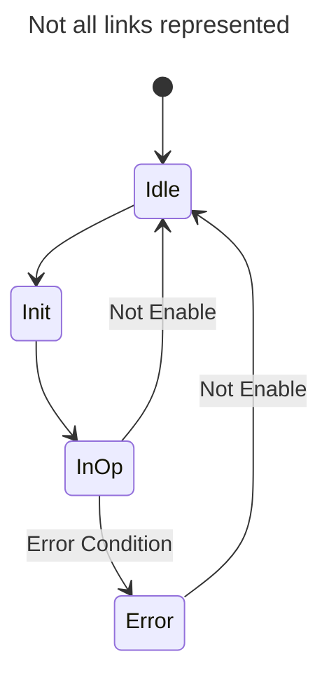
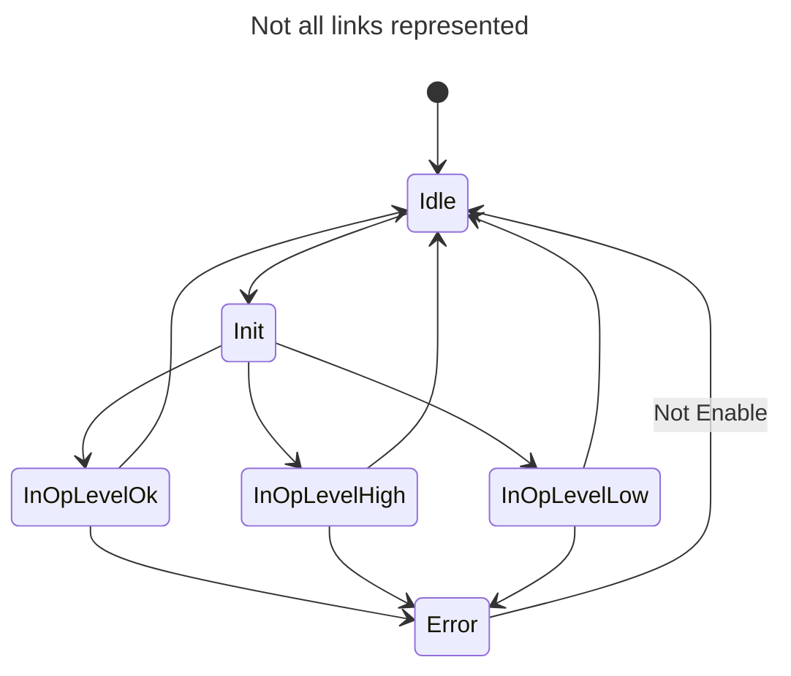

# Lab 03

Course AutB

Author: [Cédric Lenoir](mailto:cedric.lenoir@hevs.ch)  
> Version 2025, V1.0

# LAB 03 Programming a Function Block (FB) to Manage a Distance Sensor

In this lab, we will program a Function Block (FB) to manage a distance sensor.

Initially, we could use only the basic information provided by the sensor, namely the measured distance.  
However, if we want to implement additional functionalities, we will need to program them in a POU (Program Organization Unit) called the **Function Block (FB)**.  
All functionalities will be "encapsulated" in this Function Block and can be used by all sensors of the same type through **instances** of this FB.

# Sensor Description
The distance sensor we will use in this lab is manufactured by [Baumer](https://www.baumer.com/ch/en).  
It uses laser triangulation measurement technology to determine the distance to the target object.

<u>Sensor Reference</u>: O300.DL-GM1J.72N (11199079)

<br>

This sensor relies on the **IO-Link** point-to-point communication interface (compliant with IEC 61131-9).

Unlike traditional systems where analog-to-digital conversion is performed at the PLC's analog input card, this is done directly inside the sensor.

<br>

## Technical Data

|Property                          |Value|
|-----------------------------------|-------------|
|Measuring distance Sd              |30 ... 250 mm|
|Beam shape                         |point|
|Optical alignment axis             |< 2°|
|Voltage range +Vs                  |11 ... 30 VDC|
|Max consumption (no load)          |30 mA|
|Residual voltage Vd                |< 2.5 VDC|
|Reverse polarity protection        |yes|
|Short-circuit protection           |yes|
|Interface                          |IO-Link V1.1|
|Operating temperature              |-10 ... +60 °C|
|Protection class                   |IP 67|

<br>

These data are mainly relevant to the person managing the hardware.

For the PLC programmer, the focus will be on the sensor data that can be accessed for reading and, depending on access rights, also for writing.

## Synchronous Data
**Synchronous** data (Processdata) are transmitted at regular intervals. They are detailed in the table below.

### IO-Link "Processdata"
|8-23|7|6|5|4|3|2|1|0|
|----|-|-|-|-|-|-|-|-|
|MDC1| | | | |A|Q| |BDC1|

**MDC1**: sensor measurement value  
**A**: alarm bit (indicates a problem with the sensor's configuration or functionality)  
**Q**: quality bit (indicates that the signal quality is below a pre-configured threshold)  
**BDC1**: logical switching output of the sensor  

<br>

## Asynchronous Data
**Asynchronous** data can be read or modified without strict temporal synchronization.  
Some parameters are shown below as examples.

The [pre-defined parameters](#io-link-pre-defined-parameters) allow sensor identification. The [binary data channel parameters](#io-link-binary-data-channels) allow, for example, adjusting a threshold within the sensor's detection range.

### IO-Link Pre-defined Parameters
|Index      |Subindex (dec) |Access |Parameter name |Coding |Definition|
|-----------|---------------|-------|---------------|-------|----------|
|0x000C (12)| 0             |R/W    |Device Access Locks| Uint16|0: Unlocked (default)
|           |               |       |             |       |1: Device is operating properly|
|0x0010 (16)| 0             |R      |Vendor Name| String|Baumer Electric AG|
|0x0011 (17)| 0             |R      |Vendor Text| String|www.baumer.com|
|0x0012 (18)| 0             |R      |Device Name| String|Product Key External (<Product Key Internal>)|
|0x0013 (19)| 0             |R      |Product Id| String|Baumer Article Number|
|0x0014 (20)| 0             |R      |Device Text| String|Sensor specific|
|0x0015 (21)| 0             |R      |Serial Number| String|Production Order Nr / Serial Nr |
|0x0017 (23)| 0             |R      |Firmware Revision| String|Major.Minor “##.##”|
|0x0018 (24)| 0             |R/W    |Application Specific Tag|String| Default: Filled with ******, as recommended by the IO-Link spec.|
|0x0024 (36)| 0             |R      |Device Status| Uint16| 0: Device is operating properly
|           |               |       |             |       | 1: Device is operating properly
|           |               |       |             |       | 2: Out-of-Specification
|           |               |       |             |       | 3: Functional-Check
|           |               |       |             |       | 4: Failure
|           |               |       |             |       | 5 - 255: Reserved|
|0x0025 (37)| 0             |R      |Detailed Device Status| Uint16| EventQualifier “0x00” EventCode “0x00, 0x00”

<br>

### IO-Link Binary Data Channels
|Index      |Subindex (dec) |Access |Parameter name| Coding| Definition|
|-----------|---------------|-------|---------------|-------|----------|
|0x003c (60)| 01            |R/W    | Setpoint SP1  |Uint16 |Teach Point [mm] (TP)|
|           | 02            |R/W    |Setpoint SP2   |Uint16 |Not supported|
|0x003d (61)| 01            |R/W    |Switchpoint logic|Uint8|0x00: not inverted 0x01: inverted|
|           | 02            |R/(W)  |Switchpoint mode|Uint8|Fixed value 0x01: Single point mode|

<br>

Asynchronous parameter management can be done directly from the PLC.  
However, the PLC, being primarily dedicated to cyclic tasks, is not very efficient for this type of work.  
<br>
Another option is to use software provided by the manufacturers, which allows sensor configuration without going through the PLC.  
For example, Baumer offers the [Baumer Sensor Suite (BSS)](https://www.baumer.com/us/en/products/baumer-sensor-suite/a/baumer-sensor-suite).

<br>

To enable a PLC to access an IO-Link sensor, an **IO-Link Master** is required.  
<br>

This module acts as a gateway, enabling bidirectional communication between the "IO-Link" protocol and the PLC's fieldbus protocol (Profinet, EtherCAT, Ethernet/IP, Modbus TCP, etc.).


# Practical Work

<u>Objective</u>:  
Program a Function Block (FB) that reads and processes the sensor's synchronous data while integrating specific functionalities.

<br>

## Function Block (FB) Interface Description

### Input

|Name   |Type       |Description|
|-------|-----------|-----------|
|Enable	|BOOL	    |Activate Function Block, set data value in output if valid.|
|HighThreshold|REAL|Sets upper switching threshold|
|LowThreshold|REAL|Sets lower switching threshold|
|DefaultOut  |REAL        |Default value when problems occur|

### In Out
|Name   |Type       |Description|
|-------|-----------|-----------|
|hw |UA_O300_DL |In the particular context of the ctrlX to S7 interface.|

### Output
|Name         |Type         |Description         |
|-------------|:------------|--------------------|
|InOperation	|BOOL	        |Valid data at output|
|Value	|REAL	        |Distance from object in mm|
|HighLimit	      |BOOL	        |Distance above HighThreshold   |
|LowLimit	      |BOOL	        |Distance below LowThreshold   |
|Error	      |BOOL	        |There is an error   |
|ErrorID	    |WORD         |Some details about the error with Error Code.|

|ErrorID Code |Description|
|-------------|-----------|
|16#0000      |Data valid |
|16#0001      |Quality bit, signal is below the configured threshold.|
|16#0002      |Alarm bit, signal an error in sensor, this alarm has priority over ID 16#0001|
|16#0003      |Id not defined|

<br>

## Function Block (FB) Behavior

There are a few basic models that describe the behavior of Function Blocks.

For example:

- The **"In Operation Base"** model, which operates continuously.
- The **"Execute"** model, which operates based on a one-time trigger.

Managing a sensor is a typical example of an FB operating according to the **"In Operation Base"** model.  
The FB runs as long as its ``Enable`` input is activated.

<br>

The state diagram of an **In Operation Base** Function Block can be represented as follows:

<div style="text-align: center;">



</div>

<br>

<div style="text-align: center;">



</div>

<br>

We quickly notice that even if the number of states is limited, the complete representation becomes difficult to read.

**This representation will nevertheless be used to program our Function Block (FB).**

<br>

### Output Signal in Case of Malfunction or Disturbances
Depending on the sensor's use, an erroneous read value can cause problems.

If the sensor is faulty (Alarm bit signal) or if the signal quality (Quality bit signal) is not correct, **we absolutely do not want the output signal ``Value`` to be 0**.

In this case, the ``DefaultOut`` input will be assigned to the ``Value`` output.

<u>Note</u>: The system can be tested with a default ``DefaultOut`` value set to 251 (1 [mm] more than the sensor's theoretical measurement range).

# Tasks to Complete

1. Program the DUT (Data User Type) ``E_OperationBaseDL`` of type ENUM (enumeration) containing the sensor's possible states.
2. Program the FB (Function Block) ``FB_O300_DL`` using the interface below.

```iec61131-3

FUNCTION_BLOCK FB_O300_DL
VAR_INPUT
    Enable: BOOL;
    HighThreshold: REAL;
    LowThreshold: REAL;
    DefaultOut: REAL;
END_VAR
VAR_IN_OUT
    hw: UA_O300_DL;
END_VAR
VAR_OUTPUT
    InOperation: BOOL;
    Value: REAL;
    HighLimit: BOOL;
    LowLimit: BOOL;
    Error: BOOL;
    ErrorId: WORD;
END_VAR
VAR
    eOperationBaseDL: E_OperationBaseDL;
    inputConverted: REAL;
END_VAR


```

<br>

**Guidelines to Follow:**

- Write a state machine using ``CASE...OF`` with the different states and transition conditions.
- Set the output states, ``InOperation``, ``HighLimit``, ``LowLimit``, and ``Error``, considering only the states.
- Define the ``ErrorId`` variable using ``IF..ELSIF..ELSE`` conditions.
- Assign a value to the ``Value`` output variable using ``IF..ELSE`` based on the ``InOperation`` state.

N.B.: Do not forget to call the Function Block ``FB_O300_DL`` from the main program ``PRG_Student``!

<u>Information</u>:  
Name of the structured variable to access the synchronous data of the distance sensor: ``GVL_Abox.uaAboxInterface.uaO300_DL_Optic``

<br>
<br>

3. Test the Function Block (FB)

The FB's functionality will be verified using the distance sensor mounted on the unit.  
The position of the target mounted on the unit's Cartesian axis system will allow adjusting the distance measured by the sensor.


<br>

The movement of the unit's X, Y, and Z axes will be performed using the **Node-RED** application provided.

<br>

<u>Steps to Use the "Node-RED" Application</u>:

1. Replace the ``flows.json`` file located in the directory C:\Users\[your_username]\.node-red with the ``flows.json`` file located under: autb-lab-03_2025\PracticalWork_03_Student\

<br>

2. Start Node-RED  
- Open the command prompt (--> cmd.exe)  
- Enter the command: node-red  

<br>

3. Access the Node-RED user interface  
- Open the browser  
- Enter the URL: http://localhost:1880  

<br>

4) Install additional modules for the application (if necessary!)

- Click on the three horizontal lines at the top right  


--> Manage Palette  

--> Select the "Install" tab  

--> Install the following modules:  

    - @flowfuse/node-red-dashboard  
    - node-red-contrib-ctrlx-automation  

<br>

5) Open the Dashboard  

6. Start the installation using the "Siemens" operator panel  
- Select "Manual" mode using the ``Manual`` button.  
- Put the installation in the "Execute" state using the ``Reset`` and ``Start`` buttons.  


<br>

7. Move the target in front of the distance sensor using the "Node-RED" Dashboard and perform various tests to validate the correct operation of the ``FB_O300_DL`` Function Block.

<br>

# Conclusion
Function Blocks (FBs) provide **abstraction** and **modularity** that simplify the management of complex systems, make programs more readable and maintainable, and enable optimized reuse.

